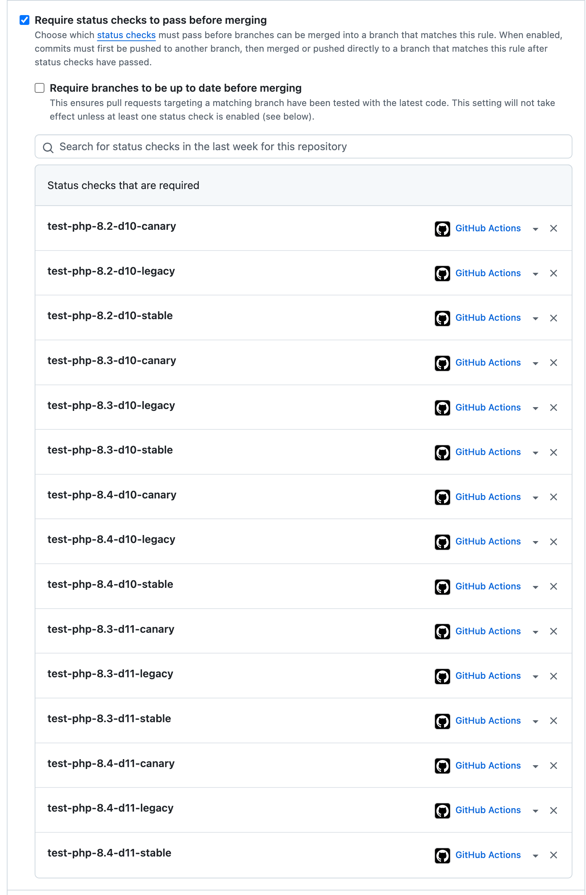

<p align="center">
  <a href="" rel="noopener">
  </a>
</p>

<h1 align="center">Template for a contributed Drupal module or theme with CI and mirroring to Drupal.org</h1>

<div align="center">

[](https://github.com/AlexSkrypnyk/drupal_extension_scaffold/issues)
[](https://github.com/AlexSkrypnyk/drupal_extension_scaffold/pulls)
[](https://github.com/AlexSkrypnyk/drupal_extension_scaffold/actions/workflows/test.yml)
[](https://circleci.com/gh/AlexSkrypnyk/drupal_extension_scaffold)
[](https://codecov.io/gh/AlexSkrypnyk/drupal_extension_scaffold)


</div>

---

## Use case

Develop a module or theme on GitHub, test it using GitHub Actions or CircleCI,
and push the code to [Drupal.org](https://drupal.org).

## Index

- [Features](#features)
- [Setup overview](#setup-overview)
- [Codebase setup](#codebase-setup)
- [Building website](#building-website)
- [Coding standards](#coding-standards)
- [Testing](#testing)
- [Branch protection](#branch-protection)
- [Deployment](#deployment)
- [Updating your extension](#updating-your-extension)
- [Maintenance](#maintenance)

## Features

- Turnkey CI configuration:
  - PHP version matrix: `8.2`, `8.3`, `8.4`.
  - Drupal version matrix: `stable`, `canary` and `legacy`.
  - CI providers: [GitHub Actions](.github/workflows/test.yml)
    and [CircleCI](.circleci/config.yml)
  - Code coverage with https://github.com/krakjoe/pcov pushed to [codecov.io](https://codecov.io).
- Develop locally using PHP running on your host using
  identical [`.devtools`](.devtools) scripts as in CI:
  - Uses [drupal-composer/drupal-project](https://github.com/drupal-composer/drupal-project)
    to create drupal site structure. Providing a custom fork of `drupal-project`
    is also supported.
  - Additional development dependenices provided in [`composer.dev.json`](composer.dev.json).
    These are merged during the codebase assembly.
  - The extension can be installed as a module or a theme: modify `type`
    property set in the `info.yml` file.
  - Additional dependencies can be added for integration testing
    between extensions: add dependencies into `suggest` section
    of `composer.json` and they will be included into the assembled codebase.
  - Patches can be applied to the dependencies: add a patch to the
    `patches` section of `composer.json`. Local patches are sourced from
    the `patches` directory.
  - Command wrappers using `make` and [Ahoy](https://github.com/ahoy-cli/ahoy)
    for common tasks.
- Codings standards checking:
  - PHP code standards checking against `Drupal` and `DrupalPractice` standards.
  - PHP code static analysis
    with PHPStan (
    including [PHPStan Drupal](https://github.com/mglaman/phpstan-drupal)).
  - PHP deprecated code analysis and auto-fixing
    with [Drupal Rector](https://github.com/palantirnet/drupal-rector).
  - PHP code mess detection with [PHPMD](https://phpmd.org/).
  - Twig code analysis
    with [Twig CS Fixer](https://github.com/VincentLanglet/Twig-CS-Fixer).
- PHPUnit testing support
- Renovate configuration to keep your repository dependencies up-to-date.
- [README.md](README.dist.md) template
- Deployment:
  - Mirroring of the repo to Drupal.org (or any other git
    repo) on release.
  - Deploy to a destination branch different from the source branch.
  - Tags mirroring.
- This template is tested in the same way as a project using it. See examples of the deployment destination repositories for [GitHub Actions](https://github.com/AlexSkrypnyk/drupal_extension_scaffold_destination_github) and [CircleCI](https://github.com/AlexSkrypnyk/drupal_extension_scaffold_destination_circleci)

## Setup overview

1. Download this extension's code by pressing 'Clone or download' button in
   GitHub UI.
2. Expand into a new directory.
3. Run the initial [codebase setup](#codebase-setup) script: `./init.sh`.
4. If you already have an existing extension code, copy it into the directory
   created in step 2.
5. [Build website](#building-website) with `make build` or `ahoy build`
   to check that everything is set up correctly.
6. [Check coding standards](#coding-standards) with `make lint` or `ahoy lint`.
7. [Run tests](#testing) with `make test` or `ahoy test`.
8. Create your extension's repository on GitHub.
9. Commit and push to your new GitHub repo.
10. If using CircleCI, login and add your new GitHub repository. Your project
    build will start momentarily.
11. [Configure branch protection in GitHub](#branch-protection).
12. [Configure deployment](#deployment) to Drupal.org.

See the sections below for more details.

## Codebase setup

The initial codebase setup script `./init.sh` will ask you for some information
and update the codebase to reflect your extension's name and other details.

<details>
<summary>Click to see <code>./init.sh</code> in action </summary>


</details>

## Building website

`make build` or `ahoy build` assembles the codebase, starts the PHP server
and provisions the Drupal website with your extension enabled. These operations
are executed using scripts within [`.devtools`](.devtools) directory. CI uses
the same scripts to build and test your extension.

The resulting codebase is then placed in the `build` directory. Your extension
files are symlinked into the Drupal site structure.

The `build` command is a wrapper for more granular commands:
```bash
make assemble     # Assemble the codebase
make start        # Start the PHP server
make provision    # Provision the Drupal website

ahoy assemble     # Assemble the codebase
ahoy start        # Start the PHP server
ahoy provision    # Provision the Drupal website
```

The `provision` command is useful for re-installing the Drupal website without
re-assembling the codebase.

See [README.md](README.dist.md) for more development commands.

<details>
<summary>Click to see <code>ahoy build</code> in action </summary>


</details>

### Drupal versions

The Drupal version used for the codebase assembly is determined by the
`DRUPAL_VERSION` variable and defaults to the latest stable version.

You can specify a different version by setting the `DRUPAL_VERSION` environment
variable before running the `make build` or `ahoy build` command:

```bash
DRUPAL_VERSION=11 make build        # Drupal 11
DRUPAL_VERSION=11@alpha make build  # Drupal 11 alpha
DRUPAL_VERSION=10@beta make build   # Drupal 10 beta
DRUPAL_VERSION=11.1 make build      # Drupal 11.1
```

The `minimum-stability` setting in the `composer.json` file is
automatically adjusted to match the specified Drupal version's stability.

### Using Drupal project fork

If you want to use a custom fork of `drupal-composer/drupal-project`, set the
`DRUPAL_PROJECT_REPO` environment variable before running the `make build` or
`ahoy build` command:

```bash
DRUPAL_PROJECT_REPO=https://github.com/me/drupal-project-fork.git make build
```

### Patching dependencies

To apply patches to the dependencies, add a patch to the `patches` section of
`composer.json`. Local patches are sourced from the `patches` directory.

### Providing `GITHUB_TOKEN`

To overcome GitHub API rate limits, you may provide a `GITHUB_TOKEN` environment
variable with a personal access token.

### Optional dependencies

If your extension requires additional dependencies for integration testing
between extensions, add the dependency into the `suggest` section of
`composer.json`. The dependency is included in the assembled codebase and
enabled in the Drupal website.

### Frontend dependencies

If your extension requires frontend dependencies for testing, add them to the
`package.json` file. The `package-lock.json` file is expected to be committed to
the repository.

The `assemble` command installs (`npm install`) and builds (`npm ci`) the
frontend dependencies. You can add and commit `.skip_npm_build` file to skip
the frontend dependencies build.

### Provisioning the website

The `provision` command installs the Drupal website from the `standard`
profile with your extension (and any `suggest`'ed extensions) enabled. The
profile can be changed by setting the `DRUPAL_PROFILE` environment variable.

The website will be available at http://localhost:8000. The hostname and port
can be changed by setting the `WEBSERVER_HOST` and `WEBSERVER_PORT` environment
variables.

An SQLite database is created in `/tmp/site_[EXTENSION_NAME].sqlite` file.
You can browse the contents of the created SQLite database using
[DB Browser for SQLite](https://sqlitebrowser.org/).

A one-time login link will be printed to the console.

## Coding standards

The `make lint` or `ahoy lint` command checks the codebase using multiple
tools:
- PHP code standards checking against `Drupal` and `DrupalPractice` standards.
- PHP code static analysis with PHPStan.
- PHP deprecated code analysis and auto-fixing with Drupal Rector.
- PHP code mess detection with PHPMD.
- Twig code analysis with Twig CS Fixer.

The configuration files for these tools are located in the root of the codebase.

<details>
<summary>Click to see <code>ahoy lint</code> in action </summary>


</details>

### Fixing coding standards issues

To fix coding standards issues automatically, run the `make lint-fix` or
`ahoy lint-fix`. This runs the same tools as `lint` command but with the
`--fix` option (for the tools that support it).

If automatic fixes are not accurate, you can adjust the configuration files
to either suppress the issue or adjust the fix.

## Testing

The `make test` or `ahoy test` command runs the PHPUnit tests for your extension.

The tests are located in the `tests/src` directory. The `phpunit.xml` file
configures PHPUnit to run the tests. It uses Drupal core's bootstrap file
`core/tests/bootstrap.php` to bootstrap the Drupal environment before running
the tests.

The `test` command is a wrapper for multiple test commands:
```bash
make test-unit        # Run Unit tests
make test-kernel      # Run Kernel tests
make test-functional  # Run Functional tests

ahoy test-unit        # Run Unit tests
ahoy test-kernel      # Run Kernel tests
ahoy test-functional  # Run Functional tests
```

<details>
<summary>Click to see <code>ahoy test</code> in action </summary>


</details>

### Running specific tests

You can run specific tests by passing a path to the test file or PHPUnit CLI
option (`--filter`, `--group`, etc.) to the `make test` or `ahoy test` command:

```bash
make test-unit tests/src/Unit/MyUnitTest.php
make test-unit -- --group=wip

ahoy test-unit tests/src/Unit/MyUnitTest.php
ahoy test-unit -- --group=wip
```

You may also run tests using the `phpunit` command directly:

```bash
cd build
./vendor/bin/phpunit tests/src/Unit/MyUnitTest.php
./vendor/bin/phpunit --group=wip
```

### Deprecated code testing

The tests are configured to check for deprecated code usage and fail if any
is found. You can fix the deprecated code or suppress the test by adding
`.deprecation-ignore.txt` file to the root of the codebase and updating
the `SYMFONY_DEPRECATIONS_HELPER` environment variable in the `phpunit.xml`.
See https://www.drupal.org/node/3285162 for more details.

Note that the CI configuration has jobs that run the unstable `canary` versions
of Drupal which may have different deprecations. These versions have the
`SYMFONY_DEPRECATIONS_HELPER` environment variable set to `disable` to ignore
deprecation errors. You may want to adjust this Ci configuration for your
project depending on your deprecated code policy.

## Branch protection

Whether you are using GitHub Actions or CircleCI, you should configure [branch
protection rules](https://docs.github.com/en/repositories/configuring-branches-and-merges-in-your-repository/managing-protected-branches/managing-a-branch-protection-rule)
in GitHub to ensure that the code tests pass before merging.

Make sure to add all jobs for your default branch:



## Deployment

The CI supports deployment of the code via mirroring of main branches
(`1.x`, `10.x-1.x` etc.) to Drupal.org repository.

The `deploy` job runs when commits are pushed to main branches
(`1.x`, `2.x`, `10.x-1.x` etc.) or when release tags are created. This means
that out-of-the-box, the deployment job will not run for other branches or
pull requests, but you can adjust the CI configuration to suit your needs.

See these examples of the deployment destination repository:
[GitHub Actions](https://github.com/AlexSkrypnyk/drupal_extension_scaffold_destination_github) and
[CircleCI](https://github.com/AlexSkrypnyk/drupal_extension_scaffold_destination_circleci)

CI will use the SSH key to push the code to the destination repository. The
public part of the SSH key should be added to your [Drupal.org account](https://git.drupalcode.org/-/user_settings/ssh_keys).
The private part of the SSH key should be added to the CI provider.

It is a good practice to use a dedicated SSH key for every project.

### Setting up SSH key for deployment

1. Generate a new SSH key without the pass phrase:

```bash
ssh-keygen -m PEM -t rsa -b 4096 -C "your_email+project_name@example.com"
```

2. Add **public** key to your [Drupal.org account](https://git.drupalcode.org/-/user_settings/ssh_keys)
3. Add **private** key to your CI:
  - GitHub Actions:
    - Go to your project -> **Settings** -> **Secrets**
    - Add a new secret with the `DEPLOY_SSH_KEY` name and the private key as
      the value.

  - CircleCI:
    - Go to your project -> **Settings** -> **SSH Permissions**
    - Put your private SSH key into the box. Leave **Hostname** empty.
    - Copy the fingerprint string from the CircleCI User Interface. Then,
      replace the `deploy_ssh_fingerprint` value in the `.circleci/config.yml`
      file with this copied fingerprint string.
    - Push the code to your repository.

4. In CI, use UI to add the following variables as secrets:

- `DEPLOY_REMOTE` - your extension's Drupal.org repository (
  i.e. `git@git.drupal.org:project/myextension.git`).
- `DEPLOY_USER_NAME` - the name of the user who commits to the
  remote repository (i.e., your name on Drupal.org).
- `DEPLOY_USER_EMAIL` - the email address of the user who commits
  to the remote repository (i.e., your email on Drupal.org).
- `DEPLOY_PROCEED` - set to `1` once CI is working, and you are ready to
  deploy. Without this variable, the deployment job will run but will not
  push the code. This is useful for testing the deployment job.

## Updating your extension

When this template is updated, you can merge the changes into your extension
codebase.

There is no easy way to automate this process, as the changes in the template
may conflict with the changes in your extension. However, you can use the
following steps to update your extension:

1. Download the latest version of this codebase by pressing 'Clone or download'
   button in GitHub UI.
2. Expand into a new directory.
3. Run the initial [codebase setup](#codebase-setup) script: `./init.sh` and
   repeat the answers you provided during the initial setup.
4. Create a new branch in your extension's repository.
5. Copy all files into your extension's directory and override the existing files.
6. Resolve any conflicts between the new files and your extension's files. Refer
   to the release notes for any breaking changes and accept/reject them as needed.
7. [Build website](#building-website) with `make build` or `ahoy build`
   to check that everything is set up correctly.
8. [Check coding standards](#coding-standards) with `make lint` or `ahoy lint`.
9. [Run tests](#testing) with `make test` or `ahoy test`.
10. Commit and push to your new GitHub repo.
11. Check that all the CI jobs are finishing successfully.
12. Merge the new branch into your main branch.
13. Check that the deployment job is working correctly.

---

## Maintenance

This template uses a demo extension code to test itself in a [dedicated GitHub
Actions CI pipeline](scaffold-test.yml).

The tests are written in [BATS](https://github.com/bats-core/bats-core) and
located in the [`.scaffold/tests`](.scaffold/tests) directory.
